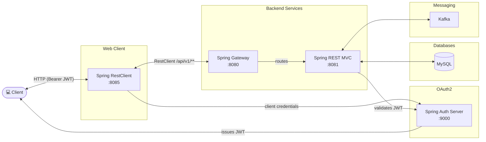

# spring-6-restclient

This project acts as a client (similar to the spring-6-restclient) project to the spring-6-rest-mvc which runs on port 8081.
Required other modules up and running:
- this application runs on port 8085/30085
- authentication server on port 9000/30900
- mvc module running on port 8081/30081
- gateway module running on port 8080 (no gateway in kubernetes)

- spring-6-rest-mvc module running on port 8081 but we are accessing this via module via the gateway which runs on port 8080



## Web Interface

This application includes a web interface that allows users to interact with the beer data through a browser. The web interface provides the following features:

- View a paginated list of beers
- Navigate through pages of beer listings
- View details of individual beers

To access the web interface, start the application and navigate to:
- http://localhost:8085/beers
- http://localhost:30085/beers

To access the openapi ui from the mvc server:
- http://localhost:8081/swagger-ui/index.html
- http://localhost:30081/swagger-ui/index.html

## Kubernetes

To run maven filtering for destination target/k8s and target target/helm run:

```bash
mvn clean install -DskipTests 
```

### Deployment with Kubernetes

Deployment goes into the default namespace.

To deploy all resources:

```bash
kubectl apply -f target/k8s/
```

To remove all resources:

```bash
kubectl delete -f target/k8s/
```

Check

```bash
kubectl get deployments -o wide
kubectl get pods -o wide
```

You can use the actuator rest call to verify via port 30085

### Deployment with Helm

Be aware that we are using a different namespace here (not default).

Go to the directory where the tgz file has been created after 'mvn install'

```powershell
cd target/helm/repo
```

unpack

```powershell
$file = Get-ChildItem -Filter spring-6-restclient-chart-*.tgz | Select-Object -First 1
tar -xvf $file.Name
```

install

```powershell
$APPLICATION_NAME = Get-ChildItem -Directory | Where-Object { $_.LastWriteTime -ge $file.LastWriteTime } | Select-Object -ExpandProperty Name
helm upgrade --install $APPLICATION_NAME ./$APPLICATION_NAME --namespace spring-6-restclient --create-namespace --wait --timeout 5m --debug --render-subchart-notes
```

show logs and show event

```powershell
kubectl get pods -n spring-6-restclient
```

replace $POD with pods from the command above

```powershell
kubectl logs $POD -n spring-6-restclient --all-containers
```

Show Details and Event

$POD_NAME can be: spring-6-restclient-mongodb, spring-6-restclient

```powershell
kubectl describe pod $POD_NAME -n spring-6-restclient
```

Show Endpoints

```powershell
kubectl get endpoints -n spring-6-restclient
```

test

```powershell
helm test $APPLICATION_NAME --namespace spring-6-restclient --logs
```

status

```powershell
helm status $APPLICATION_NAME --namespace spring-6-restclient
```

uninstall

```powershell
helm uninstall $APPLICATION_NAME --namespace spring-6-restclient
```

delete all

```powershell
kubectl delete all --all -n spring-6-restclient
```

create busybox sidecar

```powershell
kubectl run busybox-test --rm -it --image=busybox:1.36 --namespace=spring-6-restclient --command -- sh
```

You can use the actuator rest call to verify via port 30085

## Sandbox (local dev environment)

The sandbox is provisioned by the opencode-sandbox-kit and runs as a Docker container. It mounts this
repo, starts opencode, and connects the IntelliJ MCP server.

Allow the kit source (GitHub without cloning):

```powershell
sbx settings set kit.allowedSources --% "[\"docker.io/\",\"github.com/dboeckli/\"]"
```

Start a new sandbox:

```powershell
sbx run opencode --name spring-6-restclient `
    --static-mcp idea `
    --kit "git+https://github.com/dboeckli/opencode-sandbox-kit.git#dir=opencode-agent" `
    -t docker/sandbox-templates:opencode-docker-0.5.0 `
    "C:\development\projects\spring-6-restclient" `
    "C:\development\maven-repo:ro"
```

Start the sandbox with Kubernetes support:

```powershell
sbx run opencode --name spring-6-restclient `
    --static-mcp idea `
    --kit "git+https://github.com/dboeckli/opencode-sandbox-kit.git#dir=opencode-agent" `
    -t docker/sandbox-templates:opencode-docker-0.5.0 `
    "C:\development\projects\spring-6-restclient" `
    "$env:USERPROFILE\.kube:ro" `
    "C:\development\maven-repo:ro"
```

Apply the kit to an existing sandbox (restarts the sandbox, VM state is kept):

```powershell
sbx kit add spring-6-restclient "git+https://github.com/dboeckli/opencode-sandbox-kit.git#dir=opencode-agent"
```

